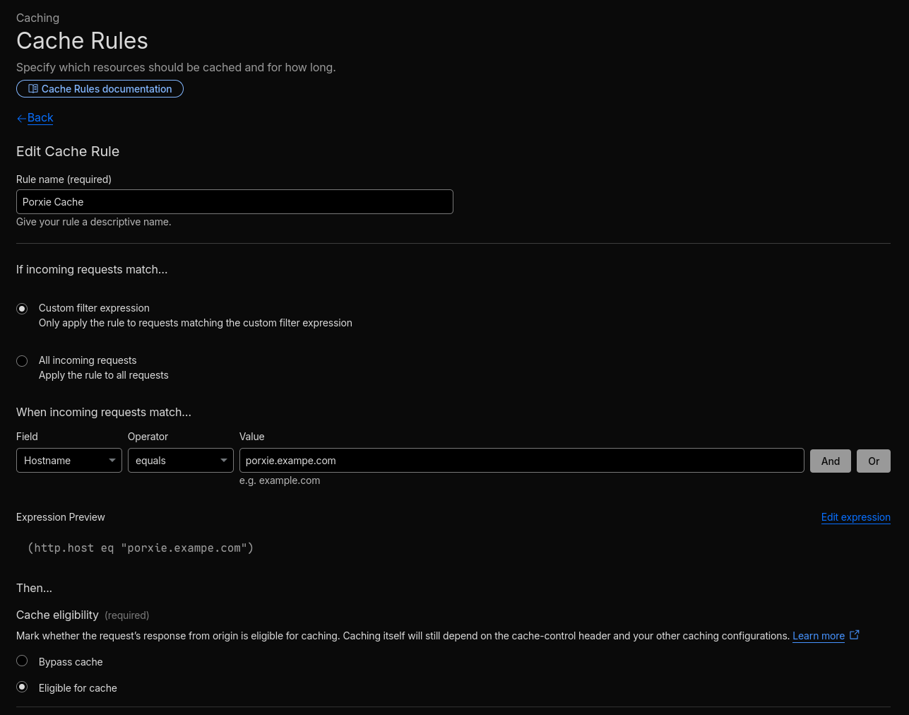

<div align="center">


# Porxie

A correct and efficient ATProtocol blob proxy for secure content delivery.

</div>

## Features

- Blob validation: verifies blob content matches its CID and rejects invalid/tampered content.
- Secure serving: blobs are always served with secure headers to help improve end-user security.
- MIME filtering: detects blob content MIME-types and enforces an allowlist of permitted types.
- Policy enforcement: can integrate with an [external policy service](#policy-service) to control which blobs can be served.
- Smart caching: configurable in-memory caching for fast repeat access with support for manual cache purging.
- Metadata calculation: remotely calculate metadata about blob content such as dimensions, sizing and more.

## Usage

> [!NOTE]
> Porxie does not handle TLS, so it should be placed behind a reverse proxy like [Caddy](https://caddyserver.com), [Traefik](https://traefik.io/traefik), or [NGINX](https://nginx.org). It is also recommended to use a dedicated caching layer in-between Porxie and your clients such as Varnish, Cloudflare, or similar.
> 
> Please ensure that any intermediary services between Porxie and the client either pass through the following headers or set them the same as Porxie does:
> - `Content-Type` (if unmodified by the service)
> - `Cache-Control`
> - `Content-Security-Policy` 
> - `Content-Disposition`
> - `X-Content-Type-Options`

### Run: Binary

To run Porxie as a binary, you'll first need to install it locally.

As Porxie has not been packaged in many places yet, the easiest way to do this is building it via Cargo. Ensure you have a relatively up to date version of [Rust and Cargo](https://rust-lang.org/tools/install/) installed before following these steps:

1. Install the binary, replacing v0.0.0 with the version you want to install:

   ```sh
   cargo install --git https://codeberg.org/Blooym/porxie.git#v0.0.0 porxie
   ```

2. Run the server with your chosen [configuration](#configuration) options:

   ```sh
   porxie
   ```

### Run: Docker / Containers

Porxie is available as a pre-built container image on [DockerHub](https://hub.docker.com/r/blooym/porxie) and can be used with whatever container setup you use. The published image runs a statically linked binary in a `scratch` environment as a non-root user by default.

You can use the following `compose.yml` template as a starting point, adding any [configuration](#configuration) options as environment variables:

```yaml
services:
  porxie:
    image: blooym/porxie:latest
    restart: unless-stopped
    read_only: true
    ports:
      - "6314:6314"
    cap_drop:
      - ALL
    security_opt:
      - no-new-privileges
```

### Run: Nix / NixOS Service

To run Porxie with Nix, you can either use the [package](https://search.nixos.org/packages?channel=unstable&query=porxie) directly or the [NixOS module](https://search.nixos.org/options?channel=unstable&query=porxie), both of which are provided directly in nixpkgs. Please refer to the Nix search page for NixOS service options.

## Routes

- **[GET]** `/{did}/{cid}`: Fetch a blob either from cache or origin.
- **[GET]** [`/xrpc/dev.blooym.porxie.getBlob?did=<did>&cid=<cid>`:](lexicons/dev/blooym/porxie/getBlob.json) XRPC compatibility shim for the fetch blob endpoint.
- **[GET]** [`/xrpc/dev.blooym.porxie.getBlobMetadata?did=<did>&cid=<cid>`](lexicons/dev/blooym/porxie/getBlobMetadata.json.json): Fetch a blob and calculate format-specific metadata.
- **[POST]** [`/xrpc/dev.blooym.porxie.cache.purgeActor?did=<did>`](lexicons/dev/blooym/porxie/cache/purgeActor.json): Purge all cached items relating to an actor DID. *(Requires Authentication)*
- **[POST]** [`/xrpc/dev.blooym.porxie.cache.purgeBlob?cid=<cid>`](lexicons/dev/blooym/porxie/cache/purgeBlob.json): Purge all cache items relating to a blob CID. *(Requires Authentication)*
- **[POST]** [`/xrpc/dev.blooym.porxie.cache.purgeAll`](lexicons/dev/blooym/porxie/cache/purgeAll.json): Purge all cache items. *(Requires Authentication)*

## Policy Service

Porxie can check with an external HTTP "policy" service before serving blobs, which is useful for moderating content or only serving specific content. You build and run this service yourself - Porxie just sends requests to an XRPC endpoint at [`/xrpc/dev.blooym.porxie.getBlobPolicy`](lexicons/dev/blooym/porxie/getBlobPolicy.json) and acts on the response accordingly.

Policy decisions will be cached using the request DID+CID by default to reduce load on the policy service. The duration that items are cached for can be configured, and the cache can be cleared manually for a blob or actor via the relevant endpoint.

By default, Porxie will fail-closed: if the policy service returns an error or is otherwise unavailable, the blob request will fail too. This behaviour can be configured to fail-open if availability is more important than applying policies.

See the [Configuration](#configuration) section for all available policy options.

## Configuration

All options can be set via flags, environment variables, or a `.env` file. For the most detailed and up-to-date descriptions, use `porxie --help`.

### Server

```
--server-address <SA_ADDRESS>
    Address to bind the server to.

    Use the 'ip:' prefix for an IP address (e.g. 'ip:127.0.0.1:6314'), or on UNIX systems,
    the 'unix:' prefix for a UNIX socket path (e.g. 'unix:/run/porxie.sock').

    [env: PORXIE_SERVER_ADDRESS=]
    [default: ip:127.0.0.1:6314]

--server-admin-password <SA_SERVER_ADMIN_PASSWORD>
    Admin password for authenticating privileged requests.

    Authenticated requests always expect the username `admin` as per specification.

    When not set, authenticated endpoints will be unavailable.

    [env: PORXIE_SERVER_ADMIN_PASSWORD=]
```

### Blob

```
--blob-allowed-mimetypes <BA_BLOB_ALLOWED_MIMETYPES>
    Blob mimetypes that can be served. Wildcards are supported "*/*", "image/*", etc.

    Validation is done loosely via content sniffing. Further validation can be done by a layer
    above this proxy, such as an image transformation service. When inference fails, the blob's
    type falls back to `application/octet-stream`. When that type is allowed, blobs failing
    inference can still be served.

    When using the CLI, the flag can be used multiple times. When setting via environment variable,
    values are comma-separated (e.g. `PORXIE_BLOB_ALLOWED_MIMETYPES="video/*,image/*"`).

    [env: PORXIE_BLOB_ALLOWED_MIMETYPES=]
    [default: image/jpeg image/png image/webp image/avif image/gif]

--blob-max-size <BA_BLOB_MAX_SIZE>
    Maximum blob size that can be served.

    This value cannot be set higher than the system's total memory.

    [env: PORXIE_BLOB_MAX_SIZE=]
    [default: 25mb]

--blob-cache-header <BA_BLOB_CACHE_HEADER>
    The Cache-Control header value to send alongside blob responses.

    This does not affect internal cache lifetimes, only how downstream clients such as CDNs
    and browsers are instructed to cache responses.

    [env: PORXIE_BLOB_CACHE_HEADER=]
    [default: "public, max-age=604800, immutable"]

--blob-processing-timeout <BA_BLOB_PROCESSING_TIMEOUT>
    Maximum duration a blob can be processed by this server before aborting.

    [env: PORXIE_BLOB_PROCESSING_TIMEOUT=]
    [default: 1m]

--blob-http-timeout <BA_BLOB_FETCH_TIMEOUT>
    Maximum duration before blob fetch requests are timed out.

    [env: PORXIE_BLOB_HTTP_TIMEOUT=]
    [default: 30s]
```

### Identity

```
--identity-plc-url <IA_PLC_URL>
    URL of the PLC instance used for `did:plc` lookups.

    [env: PORXIE_IDENTITY_PLC_URL=]
    [default: https://plc.directory]
```

### Cache

```
--cache-allocation <CA_CACHE_ALLOCATION>
    Total memory allocation for the internal cache.

    Blobs are cached using an LFU policy. The most frequently requested blobs are kept longest when the cache reaches maximum size.

    For production deployments, a CDN or caching layer in front of this server is recommended for lower latency and better global availability.

    The minimum value is 8mb and the maximum is the system's total memory.

    [env: PORXIE_CACHE_ALLOCATION=]
    [default: 512mb]

--cache-blob-tti <CA_CACHE_BLOB_TTI>
    How long blobs can be idle in the cache before expiring.

    [env: PORXIE_CACHE_BLOB_TTI=]
    [default: 7days]

--cache-ownership-ttl <CA_CACHE_OWNERSHIP_TTL>
    How long blob ownership can be cached before expiring.

    [env: PORXIE_CACHE_OWNERSHIP_TTL=]
    [default: 1day]

--cache-policy-ttl <CA_CACHE_POLICY_TTL>
    How long policy decisions can be cached before expiring.

    [env: PORXIE_CACHE_POLICY_TTL=]
    [default: 1h]

--cache-identity-ttl <CA_CACHE_IDENTITY_TTL>
    How long identity lookups (DID resolution, etc.) can be cached before expiring.

    [env: PORXIE_CACHE_IDENTITY_TTL=]
    [default: 1h]
```

### Policy Service

```
--policy-url <PA_POLICY_URL>
    Policy service URL that DID+CID pairs will be checked against.

    Requests are sent via XRPC to <url>/xrpc/dev.blooym.porxie.getBlobPolicy.

    [env: PORXIE_POLICY_URL=]

--policy-request-headers <PA_POLICY_REQ_HEADERS>
    Headers sent alongside requests to the policy service.

    Each header must be in the format "Name: value". When using the CLI, the flag can be
    used multiple times. When setting via environment variable, headers are
    pipe-separated (|).

    As pipes are used as a delimiter, they cannot be contained in headers.

    Example (CLI): '--policy-request-headers "X-Hello: world" --policy-request-headers "X-Foo: bar"'

    Example (ENV): 'PORXIE_POLICY_REQUEST_HEADERS="X-Hello: world|X-Foo: bar"'

    [env: PORXIE_POLICY_REQUEST_HEADERS=]

--policy-fail-open
    Allow requests to proceed even if the policy service is unavailable.

    Warning: enabling this means restricted blobs may be served when the policy service
    is unavailable.

    [env: PORXIE_POLICY_FAIL_OPEN=]
```

## Examples

> [!NOTE]
> The examples below are starting points to demonstrate what is possible with Porxie. They will likely need further modification to suit your needs and are not intended to be used as-is.

### Porxie & Imgproxy

[Imgproxy](https://imgproxy.net) can be placed in front of Porxie to handle image transformations such as resizing, cropping, and format conversions.

Using Docker Compose, an example `compose.yml` would look like this:

```yaml
services:
  porxie:
    image: blooym/porxie:latest
    restart: unless-stopped
    read_only: true
    cap_drop:
      - ALL
    security_opt:
      - no-new-privileges
    environment:
      PORXIE_BLOB_ALLOWED_MIMETYPES: "image/*"
      PORXIE_BLOB_MAX_SIZE: 25mb
  imgproxy:
    image: darthsim/imgproxy:latest
    restart: unless-stopped
    read_only: true
    cap_drop:
      - ALL
    security_opt:
      - no-new-privileges
    depends_on:
      - porxie
    environment:
      # See https://docs.imgproxy.net/configuration/options for all options.
      IMGPROXY_BIND: ":8080"
      IMGPROXY_BASE_URL: "http://porxie:6314/"
      IMGPROXY_ALLOWED_SOURCES: "http://porxie:6314/"
      IMGPROXY_MAX_SRC_FILE_SIZE: 25000000
      IMGPROXY_CACHE_CONTROL_PASSTHROUGH: true
      IMGPROXY_RETURN_ATTACHMENT: true
      IMGPROXY_STRIP_METADATA: true
```

#### Replicating cdn.bsky.app

Bluesky's CDN typically serves images using URLs like `https://cdn.bsky.app/img/{preset}/plain/{did}/{cid}`. By configuring imgproxy with presets and enabling preset-only mode, you can create a compatible service. The presets below are based on what Bluesky used at the time of writing and may not be up-to-date.

```yaml
IMGPROXY_PRESETS: >-
  avatar=rs:fill:1000:1000:1:1/g:ce/ext:webp,
  avatar_thumbnail=rs:fill:128:128:1:1/g:ce/q:70/ext:webp,
  feed_thumbnail=rs:fit:1000:0/q:70/ext:webp,
  feed_fullsize=ext:webp,
  banner=rs:fill:3000:1000:1:1/g:ce/ext:webp
IMGPROXY_ONLY_PRESETS: true
```

Refer to the [imgproxy documentation](https://docs.imgproxy.net) for details on creating and modifying presets.

## Operational Notes

- You will need to [manually configure a cache rule](https://developers.cloudflare.com/cache/how-to/cache-rules/) when using Cloudflare Proxying as otherwise they do not seem to cache the content (which is indicated by the `cf-cache-status` returning `DYNAMIC` instead of `HIT/MISS/REVALIDATED`). To do this, go to the 'Cache Rules' configuration and add a rule for the hostname you run Porxie on that sets "Cache Eligibility" to "Eligible for Cache". <details> <summary>Screenshot of a Cache Rule on the Cloudflare Dashboard</summary> </details>